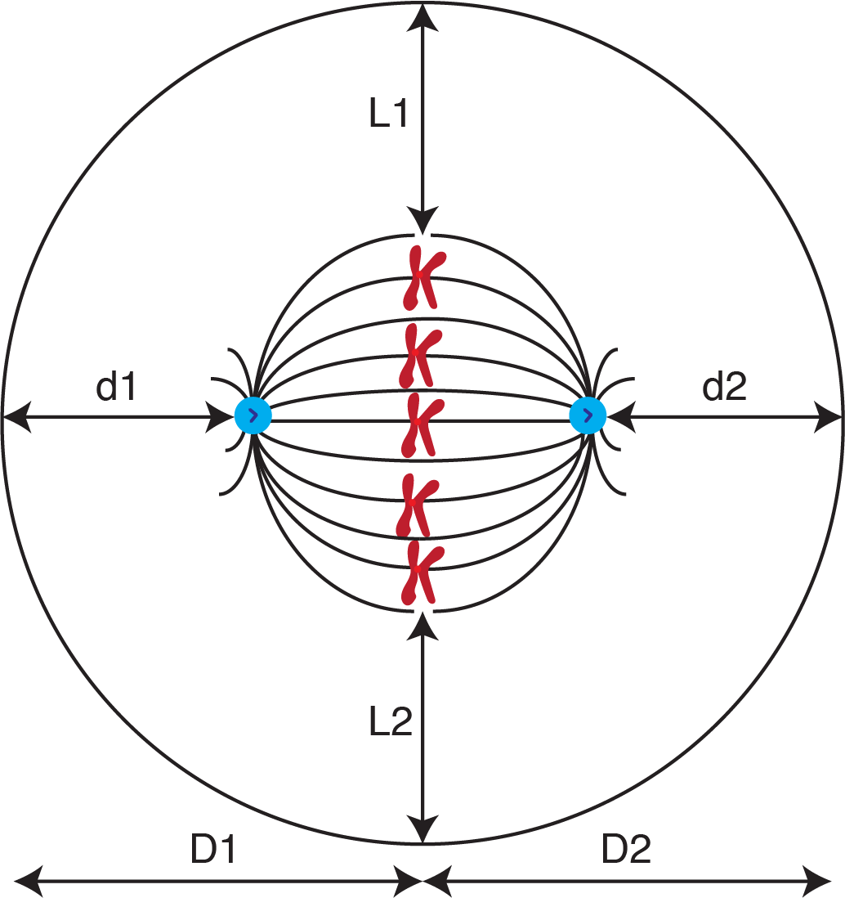

# SpindleAnalytics

A data analysis project to analyse mitotic spindle positioning and other spindle parameters using fixed microscopy data. Example data and outputs are provided to allow you to run the code and reproduce the plots, or try it on your own data. 

[**About the code**](#about-the-code) | [**Data organisation**](#data-organisation) | [**Running the code**](#running-the-code) | [**Analysis**](#analysis) | [**Outputs**](#outputs)

## About the code

The ImageJ script was written to analyse a folder containing multi channel image stacks and requires the user to select the centrosomes, draw around the cell and draw a line through the metaphase plate. The code uses `ROI_csv.py` to save the positions of the selected objects to a csv file and is output to a folder chosen by the user. The R code processes the csv files, performs calculations and generates plots. 

## Data organisation 

* The parent directory `SpindleAnalytics` contains subdirectories; `Data`, where the output from ImageJ and the `lookup.csv` are located; `Output`, where the dataframes and plots are saved to the directories `Dataframe` and `Plots`, respectively; and `Scripts`, where the ImageJ and R code are located. 
* Within `Data` there are subdirectories containing the ImageJ output from separate experiments, each labelled with their unique experiment number (e.g. `JS149`). 
* Analysis was performed blind to the conditions of the experiment so `log.txt` and `lookup.csv` are processed in R to add the original labels.

## Running the code

1. Add `Spindle_analytics.ijm` and `ROI_csv.py` to *Fiji/plugins*
2. Run `Spindle analytics` in Fiji, select the directory to be analysed and follow the on screen instructions
3. Run `Spindle_analytics_process.R` and select the directory containing the output from ImageJ. R will perform the calculations and generate a dataframe containing the parameters that is saved to *Output/Dataframe*
4. Run `Spindle_analytics_combine.R` to combine the dataframes from multiple experiments and produce plots that are saved to *Output/Plots*

## Analysis

The R script calculates a number of parameters that can be used to describe the shape, size and position of the mitotic spindle in mitotic cells. These are:

* Spindle length (distance between the two centrosomes)
* Spindle width (distance between the endpoints of the metaphase plate)
* Spindle aspect ratio (spindle length / spindle width)
* Spindle angle (acute angle between the spindle axis and the metaphase plate)
* d1 and d2 offset (where d1 and d2 are the distances between the centrosomes and the cell cortex)
* D1 and D2 offset (where D1 and D2 are the distances between the metaphase plate and the cell cortex)
* L1 and L2 offset (where L1 and L2 are the distances between the spindle edge and the cell cortex)
* Spindle offset (distance between the center of the cell and center of the spindle)

| 
|:--:|
| *Schematic of a cell in metaphase. The microtubules are shown in black, the centrosomes are shown in blue and the metaphase plate is defined by the chromosomes in red.* |

## Outputs
